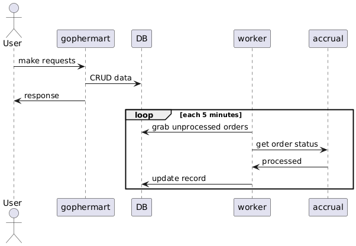
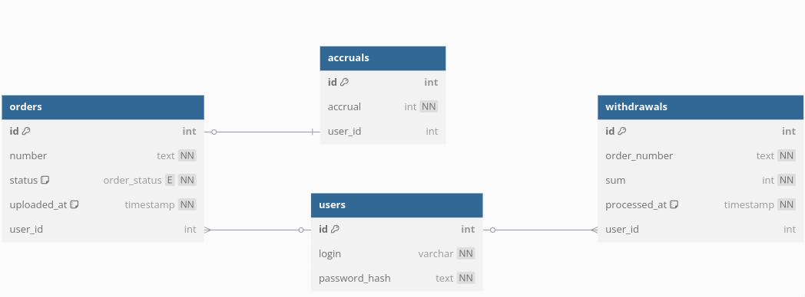

[](https://coveralls.io/github/frolmr/gophermart?branch=sprint_5_6)

# Gophermart

## Запуск

Для запуска приложения есть подготовленные Dockerfile и docker compose для развертывания всего необходимого
Запуск docker compose завернут в Taskfile, вызвать старт контейнейров можно командой `go-task up`
При этом будут запущенны контейнеры с самим приложением gophermart, а так же контейнеры с accrual, postgresql и контенейр swissknife для выполнения команд запросов внутри подсети gophermart docker compose-а
_Порт(8080) контейнера с самим приложением торчит наружу, запросы к нему можно делать напрямую_

Чтобы попасть внутрь контейнера swissknife можно так же воспользоваться командой `go-task swissknife`
Из swissknife контейнера можно отправить запросы в accrual контейнер
Пример:

```sh
go-task swissknife

ping accrual
....

curl -v -X POST -i http://accrual:8080/api/goods  --header Content-Type:application/json --data "{\"match\":\"Bork\",\"reward\":10,\"reward_type\":\"%\"}"
....

curl -v -X POST -i http://accrual:8080/api/orders  --header Content-Type:application/json --data "{\"order\":\"9278923470\",\"goods\":[{\"description\":\"Bork\",\"price\":4999}]}"
....
```

Погасить все контейнеры можно командой `go-task down`

## Реализация приложения

Приложение реализовано следующим образом:

- есть часть API, которая обрабатывает входящие запросы, взаимодействует с БД
- есть часть, которая отвечает за запросы в систему accrual (будем называть его worker)

Части работают асинхронно и независимо, в разных горутинах, по сути ничего друг о друге не зная

Та часть, которая работает с системой accrual устроена подобно background воркеру, который раз в какое-то время выбирает из БД записи в нефинальных статусах и делает запрос в accrual, если получает данные, то обновляет.
Примерная схема работы:



### Мотивация

Почему было выбрано такое решение?
Исходя из условия задачи система accrual представляет собой черный ящик. Никаких контрактов у нас нет, никаких гарантий, регламентов и т.д.
Так же по условию задания время обработки заказа системой accrual никак не регламентировано, а это значит, что order может сменить свой статус как через секунду, так и через сутки, так и через любое другое время.
Кроме того, смею предположить, что бизнес-требования вряд ли предполагают моментальную обработку заказа системой accrual, как и пользователи. Вообще говоря, задачи подобного рода решаются иными инструментами)) Но как есть.

Поэтому рационально было бы при появлении заказа в gophermart начать раз в какое-то время (у меня изначально это было 5 минут, до запуска автотестов) worker-ом выгребать из БД все заказы у которых не финальный статус и отправлять по ним запросы в accrual, при положительном ответе обновлять статус в gophermart. При том, что логика gophermart не предполагает обновления order на своей стороне, риски столкнуться с проблемами одновременного доступа к записи со стороны приложения и workera минимальны.
Проблемы могут возникнуть только в том случае, если заказов будет очень много из тех, что не в финальном статусе и worker будет сначала выгребать кучу данных, потом отправлять кучу запросов. Но это проблемы завтрашнего дня)) Сейчас мы маленький стартап и заказов немного. Потенциально для решения этой проблемы можно выгребать данные раз в 5 минут, хотя ИМХО, можно и раз в час, а то и еще больше, вряд ли пользователь сиюминутно захочет увидеть свои начисления, и размазывать запросы до следующего срабатывания, разбивая их на батчи.

Альтернативным вариантом было бы синхронно, при получении заказа в gophermart (как того предполагают автотесты) делать запрос в accrual.
Но что делать в том случае, если на стороне accrual заказ все еще REGISTERED или PROCESSING? Все равно приходится идти в фоновые обновления.
Кроме того, т.к. accrual не дает никакх гарантий, запросы к ней занимают неизвестное время, а это прям так себе для пользовательского опыта.

### Схема данных

Приложение использует следующую схему данных



#### Комментарии

- Деньги/баллы хранятся в копейках/центах/пени, т.е. в целочисленных типах для того, чтобы минимизировать риски операций чисел с плавающей запятой и округлений

- Изначально была идея реализовать что-то вроде бухгалтерского подхода в виде событий записей на счетах (кредит/дебет) и рядом с каждой операцией/событием хранить аггрегат, к которому каждая операция приводит, чтоб не пересчитывать все события, в том случае, если их много и операция тяжелая. Но пример учебный, времени не так много (еще больше убито впустую))) поэтому все упрощено до безобразия: баланс представляет собой суммы и/или разности всех начислений и списаний в разрезе пользователя. Идея с materialized view уехала туда же. Когда будет много заказав, можно будет думать в эти стороны.

- приложению для работы, помимо флагов указанных в описаниии, нужен секрет для jwt токена (из Vault, например). Т.к. автотесты не умеют в кастомные флаги/переменные, секрет генерируется автоматически при запуске. Из негативных сторон - при перезапуске приложения все токены протухают, ну и при таком подходе в кластер с несколькими инстансами/подами не поедешь.
